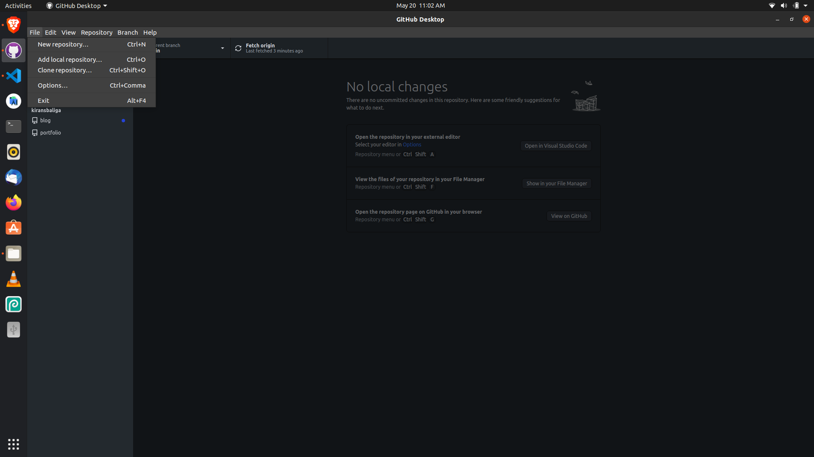
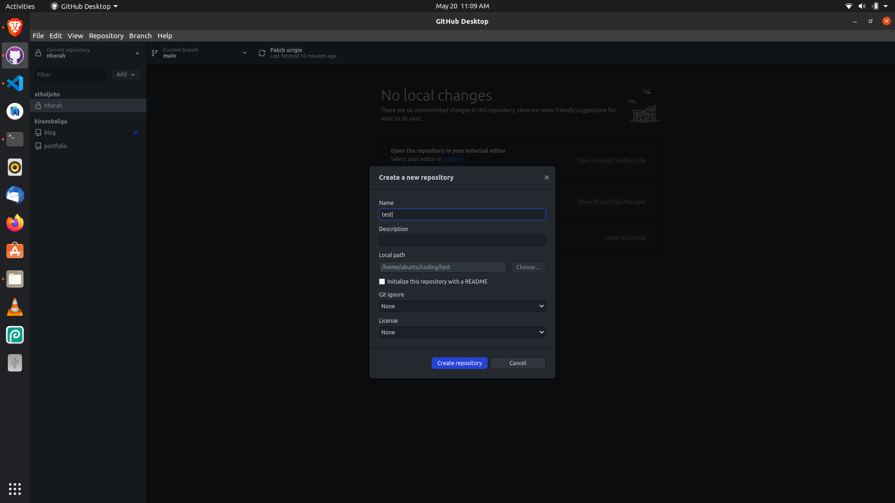
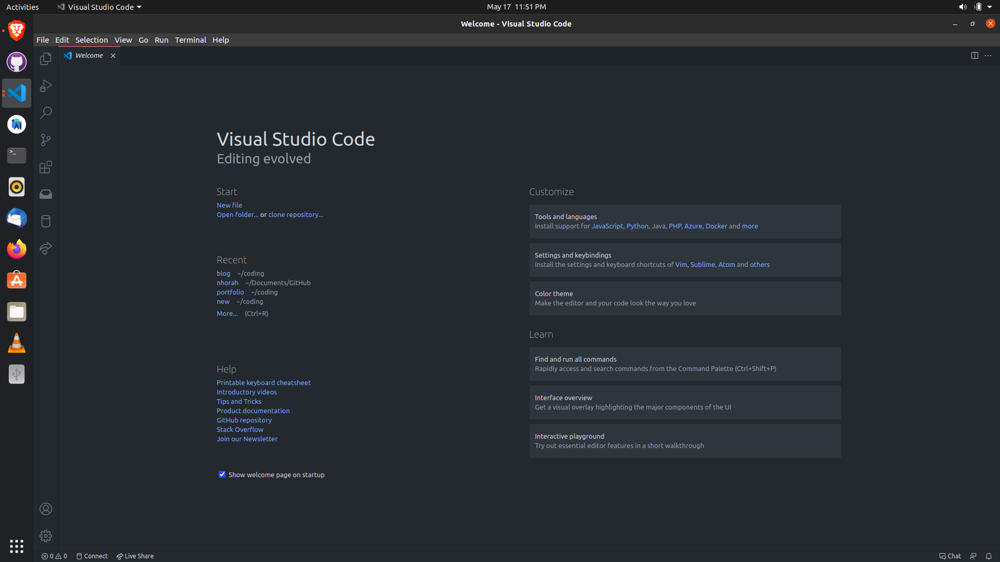
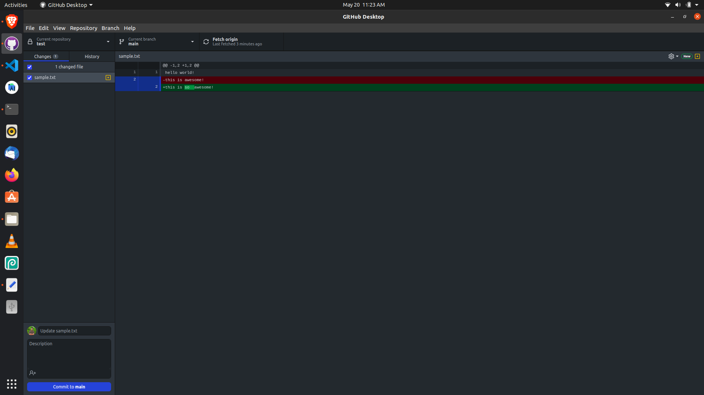
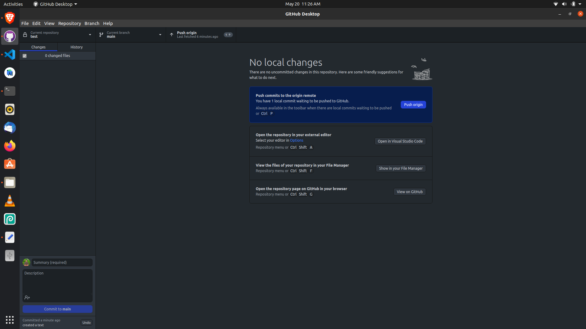

> ## What is Git?

Simply put, **Git** is software for tracking changes in any set of files, usually used for coordinating work among programmers collaboratively developing source code during software development. 

For eg:- When you collaborate with others there might be multiple changes in a same file. Using git we can track the changes and merge them accordingly so that the code as a whole will make sense.
> ## What is Github?

 **GitHub** is a provider of Internet hosting for software development and version control using **Git**. It offers the distributed version control and source code management functionality of **Git**, plus its own features.

 

> # Getting Started

We are gonna use *Github-desktop* which will easily allow us to get started with version control, which offers a *Graphical User Interface*(GUI) instead of the traditional *Command line interface*(CLI).

you can download *Github-desktop* from [here](https://desktop.github.com/).

> ## Creating a Github Account

Since were are gonna use **Github** we will need to register for an account at [**GitHub**](https://github.com) if we don’t already have one.

> ## Text Editors

To write in plain text we want to use a text editor. There are a huge number of free and paid text editors available in the internet. I recommend using **VS Code**. It is an *open source* code editor with several integrations which makes it powerful along with lots of extensions that are available.

You can dowload *VS Code* from [here](https://code.visualstudio.com/). 


> ### Open Github-desktop

- When you open for the first time you will be required to Login.
- Click on file -> create new repository OR click on clone repository option to clone from someother repository that is on **Github**.

- Choose the path to the folder where you want create the files.

- Click on create new repository
- Click on open on VS Code option


> ### Fire up VS Code

From the welcome screen select on new folder option.



Create a new file and type something in there.

```
hello world!
this is awesome!

```

- Go back to *Github-Desktop*

- Enter a commit message so that you can record a message that shows what all updates you did.
- Click on push to save changes to **Github**


And that's it for getting started with Github.
I might seem complex but after a while you will get in a hang of it!
Let me know if you have any queries!

## *carpe diem*